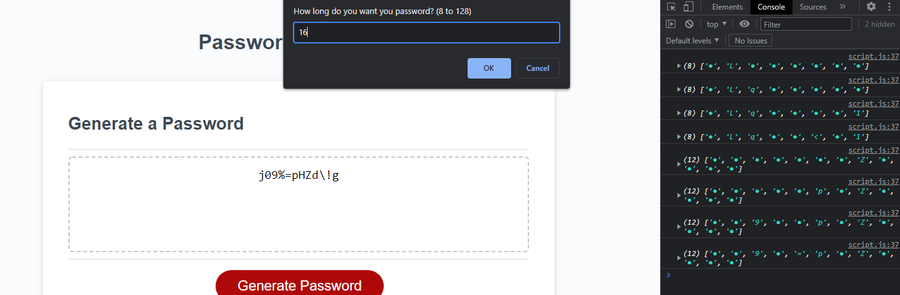
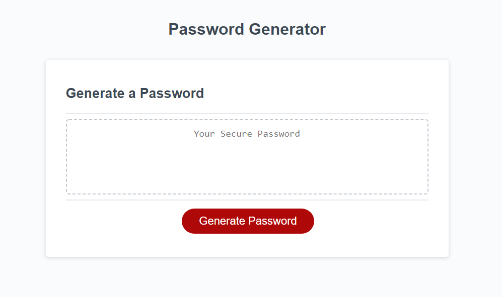

# JS Password Generator

## Description

A project for my bootcamp to create a password generating website to practice javascript. The generator is capable of creating password 8 to 128 characters in length, and can include any combination of Uppercase, Lowercase, Special (!@#$%^&*()_+), or Number characters. These paramenters are entered and confirmed in a series of prompts, alerts, and confirms.

In addition, this program also has some additional code to guarantee that at least one character from each of the character types the user selects are added to the password.

## Webpage Link

[please click here to view the webpage.](https://wruback.github.io/JS-password-generator/)

## Webpage Appearance

